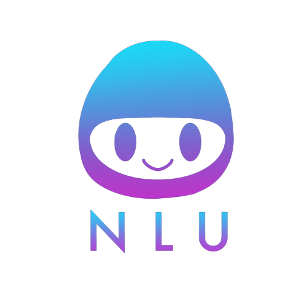

<a name="readme-top"></a>

[![Contributors][contributors-shield]][contributors-url]
[![Stargazers][stars-shield]][stars-url]
[![Issues][issues-shield]][issues-url]
[![Apache License][license-shield]][license-url]


<!-- PROJECT LOGO -->
<br />
<div align="center">
  <a href="https://github.com/rumncoke-ai/Team-NLU-Voiceflow-Extension">
    
  </a>

<h3 align="center">Voiceflow Chatbot Transcript Analyzer</h3>

<h4 align="center">By Team N.L.U. - <b>N</b>atural <b>L</b>eaders <b>U</b>nited</h4>

  <p align="center">
    The aim of our project is to access the transcript data of pre-existing chatbots from within Voiceflow using the API, and to parse and analyze this data to return suggestions for strong starting suggestions for customer chatbots!
    <br />
    <a href="https://github.com/rumncoke-ai/Team-NLU-Voiceflow-Extension"><strong>Explore the docs »</strong></a>
    <br />
    <br />
    <a href="https://www.voiceflow.com/">Check Out Voiceflow</a>
    ·
    <a href="https://github.com/users/rumncoke-ai/projects/1">View Kanban Board</a>
    ·
    <a href="https://github.com/KareemSalem7/voice-flow"> See the Frontend</a>
  </p>
</div>


<!-- TABLE OF CONTENTS -->
<details>
  <summary>Table of Contents</summary>
  <ol>
    <li>
      <a href="#about-the-project">About The Project</a>
      <ul>
        <li><a href="#built-with">Built With</a></li>
      </ul>
    </li>
    <li>
      <a href="#getting-started">Getting Started</a>
      <ul>
        <li><a href="#prerequisites">Prerequisites</a></li>
        <li><a href="#installation">Installation</a></li>
      </ul>
    </li>
    <li><a href="#usage">Usage</a></li>
    <li><a href="#license">License</a></li>

  </ol>
</details>

<!--     <li><a href="#acknowledgments">Acknowledgments</a></li> -->


<!-- ABOUT THE PROJECT-->
## About The Project

The aim of this project is to take users' pre-built chatbots on the Voiceflow platform and to parse and analyze their transcripts in order to offer suggestions for starting nodes (i.e., the initial message). We generate these suggestions based on a variety of metrics, from the overall frequency of intents to the rate at which they appear at leaf nodes (i.e., the end of an interaction). Users will then have to option to sort through these suggestions and, should they resonate with any, choose to have it automatically inserted into their Voiceflow canvas.

<!-- [![Product Name Screen Shot][product-screenshot]](https://example.com) -->

<p align="right">(<a href="#readme-top">back to top</a>)</p>


### Built With


* [![Spring][Spring.com]][Spring-url]

<p align="right">(<a href="#readme-top">back to top</a>)</p>


<!-- GETTING STARTED -->
## Getting Started

To get a local copy up and running follow these simple steps.

### Installation

1. Clone the Team-NLU-Voiceflow-Extension repository.

   ```sh
   git clone https://github.com/rumncoke-ai/Team-NLU-Voiceflow-Extension.git
   ```

2. Ensure that your project is open with the “transcript” folder as your main project folder. You may need to exit and manually reopen from the transcript file by stepping into   transcript from whereever you originally saved your local copy of the repository.

<br />

3. Run “transcript.application” to execute the main application.

<br />

4. Wait for the project to boot up and you're now ready to go!

<br />

### Common Issues:
<br/>

You may encounter a bug where many imports appear to not be recognized. This is caused by your IDE incorrectly caching. To resolve this, when you encounter this, do the following:
<br></br>
 **File -> Invalidate Caches -> Invalidate and Restart**


<p align="right">(<a href="#readme-top">back to top</a>)</p>


<!-- USAGE EXAMPLES--> 
## Usage

Please see the frontend repository for information on interfacing and interacting with the backend.

<!--_For more examples, please refer to the [Documentation](https://example.com)_-->

<p align="right">(<a href="#readme-top">back to top</a>)</p>

<!-- LICENSE -->
## License

Distributed under the Apache License. See `LICENSE` for more information.

<p align="right">(<a href="#readme-top">back to top</a>)</p>


<!-- ACKNOWLEDGMENTS 
## Acknowledgments

* []()
* []()
* []()

<p align="right">(<a href="#readme-top">back to top</a>)</p> -->


<!-- MARKDOWN LINKS & IMAGES -->
<!-- https://www.markdownguide.org/basic-syntax/#reference-style-links -->
[contributors-shield]: https://img.shields.io/github/contributors/rumncoke-ai/Team-NLU-Voiceflow-Extension.svg?style=for-the-badge
[contributors-url]: https://github.com/rumncoke-ai/Team-NLU-Voiceflow-Extension/graphs/contributors
[stars-shield]: https://img.shields.io/github/stars/rumncoke-ai/Team-NLU-Voiceflow-Extension.svg?style=for-the-badge
[stars-url]: https://github.com/rumncoke-ai/Team-NLU-Voiceflow-Extension/stargazers
[issues-shield]: https://img.shields.io/github/issues/rumncoke-ai/Team-NLU-Voiceflow-Extension.svg?style=for-the-badge
[issues-url]: https://github.com/rumncoke-ai/Team-NLU-Voiceflow-Extension/graphs/issues
[license-shield]: https://img.shields.io/badge/License-Apache_2.0-blue.svg?style=for-the-badge&logo
[license-url]: https://github.com/rumncoke-ai/Team-NLU-Voiceflow-Extension/blob/master/LICENSE
[product-screenshot]: images/screenshot.png
[Spring.com]: https://img.shields.io/badge/Spring-6DB33f?style=for-the-badge&logo=spring&logoColor=white
[Spring-url]: https://spring.io/
